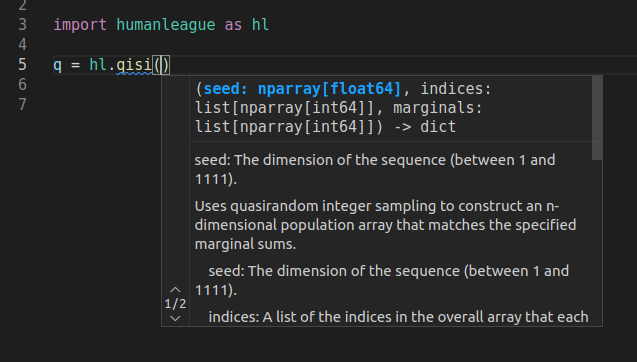

# humanleague

[](https://opensource.org/licenses/MIT)

[](https://pypi.org/project/humanleague/)
[](https://badge.fury.io/py/humanleague)
[](https://CRAN.R-project.org/package=humanleague)

[](https://zenodo.org/badge/latestdoi/95961787)
[](https://joss.theoj.org/papers/d5aaf6e1c2efed431c506762622473b4)

[](https://github.com/virgesmith/humanleague/actions/workflows/python-test.yml/badge.svg)
[](https://github.com/virgesmith/humanleague/actions/workflows/r-cmd-check/badge.svg)

[](https://www.codacy.com/gh/virgesmith/humanleague/dashboard?utm_source=github.com&amp;utm_medium=referral&amp;utm_content=virgesmith/humanleague&amp;utm_campaign=Badge_Grade)
[](https://codecov.io/gh/virgesmith/humanleague)

## Introduction

*humanleague* is a python *and* an R package for microsynthesising populations from marginal and (optionally) seed data. The package is implemented in C++ for performance.

The package contains algorithms that use a number of different microsynthesis techniques:

- [Iterative Proportional Fitting (IPF)](https://en.wikipedia.org/wiki/Iterative_proportional_fitting)
- [Quasirandom Integer Sampling (QIS)](http://jasss.soc.surrey.ac.uk/20/4/14.html) (no seed population)
- Quasirandom Integer Sampling of IPF (QISI): A combination of the two techniques whereby the integral population is sampled (without replacement) from a distribution constructed from a dynamic IPF solution.

The latter provides a bridge between deterministic reweighting and combinatorial optimisation, offering advantages of both techniques:

- generates high-entropy integral populations
- can be used to generate multiple populations for sensitivity analysis
- goes some way to address the 'empty cells' issues that can occur in straight IPF
- relatively fast computation time

The algorithms:

- support arbitrary dimensionality* for both the marginals and the seed.
- produce statistical data to ascertain the likelihood/degeneracy of the population (where appropriate).

The package also contains the following utilities:

- a Sobol sequence generator (implemented as a generator class in python)
- a function to construct a closest integer population from a discrete univariate probability distribution.
- an algorithm for sampling an integer population from a discrete multivariate probability distribution, constrained to the marginal sums in every dimension (see [below](#multidimensional-integerisation)).
- 'flatten' a multidimensional population into a table: this converts a multidimensional array containing the population count for each state into a table listing individuals and their characteristics.

Version 1.0.1 reflects the work described in the [Quasirandom Integer Sampling (QIS)](http://jasss.soc.surrey.ac.uk/20/4/14.html) paper.

## Installation

### Python

Requires Python 3.11 or newer. The package can be installed using `pip`, e.g.


```bash
python -m pip install humanleague --user
```

#### Development

Fork or clone the repo, then

```bash
pip install -e .[dev]
pytest
```

### R

Official release:

```r
> install.packages("humanleague")
```

For a development version

```r
> devtools::install_github("virgesmith/humanleague")
```

Or, for the legacy version

```r
> devtools::install_github("virgesmith/humanleague@1.0.1")
```

## Documentation and Examples

### R

Consult the package documentation, e.g.

```r
> library(humanleague)
> ?humanleague
```

### Python

The package now contains type annotations and your IDE should automatically display this, e.g.:



NB type stubs are generated using the `pybind11-stubgen` package, with some [manual corrections](./doc/type-stubs.md).

### Multidimensional integerisation

Building on the one-dimensionl `integerise` function - which given a discrete probability distribution and a count, returns the closest integer population to the distribution that sums to the count - a multidimensional equivalent `integerise` is introduced. In one dimension, for example this:

```python
>>> import humanleague
>>> p = [0.1, 0.2, 0.3, 0.4]
>>> result, stats = humanleague.integerise(p, 11)
>>> result
array([1, 2, 3, 5], dtype=int32)
>>> stats
{'rmse': 0.3535533905932736}
```

produces the optimal (i.e. closest possible) integer population to the discrete distribution.

The `integerise` function generalises this problem and applies it to higher dimensions: given an n-dimensional array of real numbers where the 1-d marginal sums in every dimension are integral (and thus the total population is too), it attempts to find an integral array that also satisfies these constraints.

The QISI algorithm is repurposed to this end. As it is a sampling algorithm it cannot guarantee that a solution is found, and if so, whether the solution is optimal. If it fails this does not prove that a solution does not exist for the given input.

```python
>>> import numpy as np
>>> a = np.array([[ 0.3,  1.2,  2. ,  1.5],
                  [ 0.6,  2.4,  4. ,  3. ],
                  [ 1.5,  6. , 10. ,  7.5],
                  [ 0.6,  2.4,  4. ,  3. ]])
# marginal sums
>>> a.sum(axis=0)
array([ 3., 12., 20., 15.])
>>> a.sum(axis=1)
array([ 5., 10., 25., 10.])
# perform integerisation
>>> result, stats = humanleague.integerise(a)
>>> stats
{'conv': True, 'rmse': 0.5766281297335398}
>>> result
array([[ 0,  2,  2,  1],
       [ 0,  3,  4,  3],
       [ 2,  6, 10,  7],
       [ 1,  1,  4,  4]])
# check marginals are preserved
>>> (result.sum(axis=0) == a.sum(axis=0)).all()
True
>>> (result.sum(axis=1) == a.sum(axis=1)).all()
True
```
