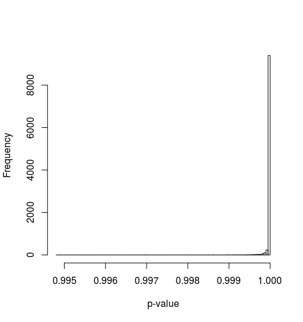

***
Established methods for synthesising a population from geographically aggregated data are robust and well understood. However, most rely on the potentially detrimental process of "integerisation" if a whole-individual population is required, e.g. be used for Agent-Based Modelling. This paper investigates a sampling method of synthesis that is computationally efficient and results directly in integer populations. We showcase the concept of quasirandom sequences and demonstrate that they perform far better than pseudorandom numbers in this context. We demonstrate that sampling the marginal distributions ^without replacement^ is crucial. We perform some comparative statistical analyses of example populations, and highlight the advantages and disadvantages of our method over the established ones. Our implementation is available in an open-source R package `humanleague`.

***

# Introduction

Iterative Proportional Fitting (IPF) is a popular and well-established technique for generating synthetic populations from marginal data. Compared with other methods of 'population synthesis' IPF is relatively fast, simple and easy to implement, as showcased in a practical introduction to the subject by @lovelace_spatial_2016.
Furthermore, a number of software packages aimed at facilitating IPF for spatial microsimulation and other applications have been published [e.g. @barthelemy_cran_2016; @jones_raker:_2016].

However, the method has various limitations from the perspective of spatial microsimulation for social simulation. For example,
IPF generates fractional weights instead of integer populations, an issue tackled by 'integerisation' techniques [@lovelace_truncate_2013]; handles 'empty cells' poorly [@lovelace_evaluating_2015]; and requires a representative individual-level 'seed' population. The most in-depth exploration of such limitations and the mathematical behaviour of IPF to date is an outstanding PhD thesis on the subject [@zaloznik_iterative_2011].

In this paper we investigate sampling techniques where a population matrix is built exclusively in the integer domain. We show that this technique can only work effectively if a quasirandom (as opposed to a pseudorandom) number generator is used, and this in itself is not sufficient to work in all cases. We also show that this problem can be overcome by combining the quasirandom generator with a sampling-without-replacement algorithm. We then look at the statistical properties of the resulting populations, comparing them to populations generated with the IPF algorithm.

# Theory

## Degeneracy and Statistical Likelihood

In this work we define degeneracy as the number of possible different ways a given overall population can be sampled. Making the assumption that marginals are uncorrelated, the higher the degeneracy of the population, the more statistically likely the population is. We measure the degeneracy of populations using a $\chi^2$ statistic:

$$\chi^2 = \frac{\sum\limits_{\mathbf{k}}(\mathbf{T}_\mathbf{k}-p_\mathbf{k}S)^2}{p_\mathbf{k}S}$$

from which we can estimate a p-value, which represents the statistical significance of the synthetic population. 

$$p=1-\mathbb{P}[d/2,\chi^2]$$
where $\mathbb{P}$ is the cumulative $\chi^2$ density function and $d$ the degrees of freedom of the system. 

The aim in this context is to generate populations with a high p-value, i.e. a low statistical significance and a high-degeneracy. 

## Quasirandom Numbers

Quasirandom numbers, often referred to as low discrepancy sequences, are preferential to pseudorandom numbers in many applications, despite not having some of the (appearance of) randomness that good pseudorandom generators possess. In this work we focus on the Sobol quasirandom sequence [@bratley_algorithm_1988; @joe_remark_2003].

Figure 1 qualitatively illustrates the difference between pseudo- and quasirandom sampling. Each plot contains 2000 uniform points in two dimensions. The quasirandom samples fill the sample space far more evenly and display an obvious lack of randomness, clearly showing a lack of independence between samples. Conversely, the pseudorandom samples show no discernable pattern with clusters and gaps present in the sampling domain, suggesting independence between variates.

Sobol sequences, as with other quasirandom sequences, have an inherent dimensionality and a relatively short period - the sequence is exhausted once every integer in the sample space has been sampled . Successive samples evenly fill the sample space, and thus lack independence. Conversely, a good pseudorandom generator has no discernible dependence between variates often has a much longer period, allowing for very large samples to be taken. 

For applications such as numerical integration, Sobol sequences converge at a rate of $\approx1/N$ (actually $(ln N)^D/N$ [@vetterling_numerical_1992] compared to $\approx1/\sqrt N$ for a pseudorandom generator, and thus require far fewer samples to achieve the same level of accuracy.

Quasirandom sequences are not seeded like pseudorandom generators. To avoid repetition, and for better degeneracy, it is recommended to discard a number of variates on initialisation [@joe_remark_2003], and on subsequent sampling continue the sequence from its previous position.
For comparison in the analysis below, we use the MT19937 variant of the Mersenne Twister pseudorandom generator [@matsumoto_mersenne_1998].

```{r, echo=FALSE, out.width="50%", fig.show='hold', fig.cap="2000 uniform 2d samples -  pseudorandom and quasirandom."}
knitr::include_graphics(c("figures/pseudo2d.png","figures/quasi2d.png"))
```

## Sampling without Replacement

Given discretely distributed population $P$ with integral frequencies $\{f_0,f_1,...f_n\}$, a random sample $i \in \{0...n\}$ has probability 

$$p(i) = \frac{f_i}{\sum\limits_{j=0}^{n}f_j}$$

Once a sample $i$ is taken the distribution is adjusted to $\{f_0,f_1,...f_i-1,....f_n\}$. Once $f_i$ has reached zero no further samples can take the value $i$ since $p(i) = 0$. 

Since $f_i$ cannot be oversampled, this implies that all the other states $f_{j\neq{i}}$ cannot be undersampled. By extension, if all but one states $f_{i\neq{j}}$ cannot be oversampled, then $f_j$ cannot be undersampled. Thus each state can neither be under- nor oversampled: the distibution must be matched exactly.

## Problem Statement

A mathematical statement of population synthesis is as follows:^[In the notation below, the index $i$ is scalar and refers to a particular dimension. The index $\mathbf{k}$ is a vector index $\{k_1, k_2,...k_D\}$ of length $D$, the dimensionality of the problem.]

Given a population $P$ and a set of $D$ marginal vectors $\mathbf{m}_i$ of length $l_i$ such that we have $S$ possible states

$$S=\prod\limits_{i=1}^{D}l_i$$

Find a contingency table $\mathbf T$ in $D$ dimensions such that

$$\sum\limits_{\mathbf{k}, k_i fixed} \mathbf{T}_\mathbf{k} = \mathbf{m}_i$$

in other words each element of $\mathbf{m}_i$ is the sum of all elements in $\mathbf{T}$ for a fixed value of $k_i$. We define this as constraint (1).

Each marginal sum and the sum of the elements of contingency table must equal the population $P$:

$$\sum\limits \mathbf{m}_{i} = \sum\limits_\mathbf{k} \mathbf{T} = P$$ 

We define this as constraint (2). Finally, constraint (3) restricts the elements to the natural numbers: 

$${\mathbf{T} \in \mathbb{N}^S,\mathbf{m}_i} \in \mathbb{N}^{l_i}$$ 

The probability of a given state $\mathbf{k}$ being occupied is thus the product of the marginal probabilities:

$$p_{\mathbf{k}} = \prod\limits_{i=1}^{D}(\mathbf{m}_i)_\mathbf{k}/P$$

And the degrees of freedom $d$ of the system (required in order to calculate the statistical significance of the population) is given by
$$d=\prod\limits_{i}l_i-1$$

In the general case there are not enough constraints to determine a unique solution. Hence there is a need to resort to iterative or optimisation-type solutions, such as IPF, simulated annealing, likelihood estimate, chi-squared fitting, or least-squares fitting.

# The Algorithm

The final version of the algorithm is outlined in this section, a description of the process by which we arrived at this algorithm follows in the Discussion.

1. Create an $D$-dimensional discrete without-replacement distribution using the marginals $\mathbf{m}_i$

2. Sample $P$ random variates from this distribution to create a population $\mathbf{T}$. Specifically, we sample a value of $\mathbf{k}$ and increment the value of $\mathbf{T}_\mathbf{k}$, repeating until the distribution is fully depleted. Constructing the problem in this way automatically ensures that all constraints are automatically met, as explained in the previous section.

3. Compute occupation probabilities $p_\mathbf{k}$ for each state $\mathbf{k}$. 

4. Compute a $\chi^2$ statistic and a p-value, which represents the statistical significance of the synthetic population (in this case we prefer higher p-values, i.e. statistically insignificant populations.

## The Implementation

The algorithm is implemented in an `R` package called `humanleague`, written in `C++11` and `C` and exposed to `R` via `Rcpp`. We used open source implementations of the Sobol sequence generator [@johnson_stevengj/nlopt:_nodate] and the incomplete gamma function [@burkardt_asa032_2008]. 

One of the many useful features introduced in `C++11` was a random number framework, which splits underlying (uniform) generators and the distributions, and defines APIs that these classes should implement [http://en.cppreference.com/w/cpp/numeric/random] (http://en.cppreference.com/w/cpp/numeric/random). There is no native support for quasirandom generators nor for without-replacement distributions, but by conforming to the APIs they can be implemented to easily interoperate with the native implementations.

It should be noted that there are two instances where the new types are non-conformant (see below):
- a quasirandom generator has inherent dimensionality, and thus should return that number of variates per sample. In our implementation we provided both single value and multiple value accessor functions.
- without-replacement sampling will eventually become exhausted, as a result we provided a function to test if the distribution is empty, and our accessor function throws an exception if the distribution is fully depleted.

The remainder of the code was developed by the authors. The Sobol sequence generator is implemented in such a way that it is not reset each time a population is requested, allowing different populations to be generated each time, up to the limit of the sequence being exhausted. Our implementation uses 32-bit unsigned integers and allows for $\approx4\times10^9$ samples (in each dimension). 

```{cpp}
  class Sobol
  {
  public:
    typedef uint32_t result_type;
    explicit Sobol(uint32_t dim, result_type nSkip = 0u);
    ~Sobol();
    const std::vector<result_type>& buf();
    result_type operator()();
    void skip(result_type n);
    result_type min() const;
    result_type max() const;
  private:
    SobolData* m_s;
    uint32_t m_dim;
    std::vector<result_type> m_buf;
    uint32_t m_pos;
  };

  template<typename I> // I must be an integral type
  class discrete_distribution_without_replacement
  {
  public:
    typedef I result_type;
    // enforce integral types only
    static_assert(std::is_integral<I>::value, 
      "discrete_distribution_without_replacement: only integral types supported");
    discrete_distribution_without_replacement(typename std::vector<I>::const_iterator b, 
                                              typename std::vector<I>::const_iterator e);
    // std::distribution compatibility
    template<typename R>
    result_type operator()(R& rng);
    result_type operator()(result_type r);
    bool empty() const;
  private:
    std::vector<I> m_freq;
    I m_sum;
  };

```

The the package is freely available at [https://github.com/CatchDat/humanleague](https://github.com/CatchDat/humanleague). Plans are in progress to submit it the offical CRAN repository.

The implementation supports dimensionalities up to 12, although this limit is arbitrary and could be increased if necessary. Input is simply a list of integer vectors representing the marginals. Marginal vector must all sum to the population $P$.

The output is broadly compatible with the established `mipfp` (Barthelemy & Suesse 2016) `R` package: 

- $D$-dimensional population table $\mathbf{T_\mathbf{k}}$
- $D$-dimensional occupancy probability array $\mathbf{p_\mathbf{k}}$
- boolean value indicating convergence
- maximum value of each residual vector
- $\chi^2$ statistic
- p-value

as can be seen by the example output below:

```
  > x=c(10,10,10)
  > p=humanleague::synthPop(list(x,x))
  > p
  $method
  [1] "qiws"
  
  $conv
  [1] TRUE
  
  $chiSq
  [1] 1.2
  
  $pValue
  [1] 0.8780986
  
  $error.margins
  [1] 0 0
  
  $p.hat
            [,1]      [,2]      [,3]
  [1,] 0.1111111 0.1111111 0.1111111
  [2,] 0.1111111 0.1111111 0.1111111
  [3,] 0.1111111 0.1111111 0.1111111
  
  $x.hat
       [,1] [,2] [,3]
  [1,]    4    3    3
  [2,]    4    3    3
  [3,]    2    4    4
```

# Comparison to Existing Methods

## Statistical Properties

For this we compared the QIWS algorithm to IPF using a number of two-dimensional test cases.

No integerisation was done to the IPF data (using e.g. the `R` package `rakeR`) due to that fact that integerisation can cause a mismatch in one or more margials.

IPF was initialised with a random seed array, each element uniformly distributed in $[0,2)$

The first three tests are made-up examples. The remainder are marginal figures derived from 2011 UK census data at the MSOA level (mid-layer super output area), with one dimension representing person status in terms of age, sex, and economic activity, the other their workplace location.

Table 1: Convergence behaviour of population synthesis algorithms. $N$ is the number of times the algorithm was run, $\bar{c}$ refers to the convergence success rate, and $\bar{p}$ refers to the mean p-value.

 Pop | States |  N | QIWS $\bar{c}$ | QIWS $\bar{p}$ | IPF $\bar{c}$ | IPF $\bar{p}$  
:---:|--------|----|----------------|----------------|---------------|---------------
   20|       4|1000|               1|            0.79|              1|0.48
  125|      25|1000|               1|            0.91|              1|0.06
  935|      49|1000|               1|            0.86|              1|0.03
 4958|   16032|1000|               1|            0.81|              1|1
 4098|   11760|1000|               1|            0.8 |              1|1
 4029|   11904|1000|               1|            0.8 |              1|1
 4989|   14640|1000|               1|            0.79|              1|1
 5219|   15168|1000|               1|            0.79|              1|1

A more detailed analysis was performed on two evenly distributed marginal vectors of length 10 and a population $P$ = 100 and number of states $S$ = 100, sampling 10000 populations.

For reference, the histogram of p-values using IPF (with random seed values) yields the following rather unsurprising result:

```{r, echo=FALSE, fig.show="asis", fig.align='center', fig.cap="Distribution of p-values of IPF.", out.width="50%"}
 
``` 
We compared the statistical performance of QIWS using a pseudorandom generator and a quasirandom generator. The algorithm is guaranteed to work in both cases so we looked at the distribution of p-values, which can be seen in figure 2.

```{r, echo=FALSE, out.width="50%", fig.show="hold", fig.cap="Distribution of p-values of QIWS using PRNG (left) and QRNG (right)."}
knitr::include_graphics(c("figures/iqws_prng_pvalue_dist.png","figures/iqws_pvalue_dist.png")) 
```

## Performance

Since computers vary widely in performance for many reasons, we present normalised performance values.

Table 2: Relative computation time of the algorithms, using the first case as a baseline. 

Pop | States |  N | QIWS | IPF 
:--:|--------|----|------|------
  20|       4|1000|  1.0 |66.3
 125|      25|1000|  1.3 |96.7
 935|      49|1000|  2.3 |68.3
4958|   16032|1000|  30.7|1559.3
4098|   11760|1000|  23.0|1069.0
4029|   11904|1000|  22.7|1027.3
4989|   14640|1000|  28.3|1457.0
5219|   15168|1000|  28.7|1557.7

# Discussion

## Evolution of the algorithm. 

The motivation behind the development of this method came from the fact that IPF, in general, does not generate integral populations in each state. If the resulting population is used as a basis for Agent-Based Modelling (ABM), then an integerisation process must be applied to the synthesised population. Whilst this process preserves the overall population, it may not exactly preserve all of the marginal distributions. 

Although integerisation may not introduce significant errors, the authors considered whether there was an alternative method of synthesis that would directly result in an integral population that exactly matched the marginal distributions.

We could not find any references in the literature on the use of quasirandom sequences for the purpose of population synthesis, and so decided to investigate the suitability of sampling algorithms using such sequences.

Firstly, it was demonstrated that naive pseudorandom sampling could not reliably generate populations matching the marginals. Since successive samples are ostensibly independent, there is no mechanism to reduce under- or oversampling of any particular state. 

The initial algorithm simply sampled the marginal distributions (with replacement), using quasirandom numbers, to build a population. For "toy" problems this method often worked, but for more complex problems the algorithm often failed to exactly match all the marginals.

In general, the resulting population mismatched the marginals only slightly. A correction algorithm was implemented which, applied at most once for each dimension of the population, adjusted the states by the error in the marginal for that dimension. This corrected the overall population, and is reminiscent of an iteration in IPF.

It was also demonstrated that a correction step as described above could not be applied to a pseudorandomly generated population because the marginal errors were generally to large to be able to apply a correction: such corrections would typically result in a negative population in one or more states.

Furthermore, it was shown that even using quasirandom sampling, it was not always guaranteed that a population could be corrected using the method described above without a negative population in one or more states. The sparser (the ratio of the total population $P$ to the number of possible states $S$) the population, the more often this would occur. Often the solution was simply to discard and resample the population until an exact or correctable population was generated. This raised a concern about the reliability (and efficiency) of the algorithm, and in fact further testing did reveal cases where the algorithm the number of resamples required was unacceptably large, even exhausting the period of the generator.

This flaw drove the authors to come up with an alternative formulation of the algorithm, and it transpired that without-replacement sampling would guarantee that the population matched all marginals by design (as explained in section 2.2) the, eliminating the need for the correction step entirely. In fact, this method is guaranteed to work regardless of the underlying random number generation. 

The next phase of the work was to analyse generated populations statistically, focussing on the degeneracy of the resulting populations. The results from this work, presented in the previous section, are discussed below.

## Statistical Properties

Neither IPF nor QIWS failed to converge on any of the test cases in Table 1.

One unexpected observation was that IPF performed least well on the simple tests, generating the lowest mean p-values.

To put pseudorandom versus quasirandom sampling into context, consider a "random" number generator that simply always returns zero. If we used this as the basis for without-replacement sampling of a marginal distribution $\lbrace10,10,10\rbrace$. We would get a sequence consisting of ten ones, ten twos and ten threes as the samples exhausted each bin and moved to the next. In two dimensions, this would result in a population matrix

$$\left( \begin{array}{ccc}
10 & 0 & 0 \\
0 & 10 & 0 \\
0 & 0 & 10 \end{array} \right)$$

suggesting that the marginals are strongly correlated. This particular result has a low degeneracy - there are relatively few different ways at arriving at this result - and a p-value of effectively zero implying that it is vanishingly unlikely that this population resulted by chance.

The $\chi^2$ value resulting from IPF is likely to be slightly lower than QIWS due to the fact the former numbers are not generally integral. Figure 2 demonstrates that IPF almost always results in a p-value of 1. This is expected due to the way that the IPF algorithm works. 

QIWS does not achieve such high p-values in general, as seen in figure 3, and there is a marked difference in the distribution of p-values depending on the type of underlying random generator used. It can be seen clearly that quasirandom sampling generally yields more degenerate populations, and is much closer to IPF in this respect. 

It should be borne in mind that QIPF cannot achieve the same p-value levels as IPF due to the simple fact that the population is integral, as this will generally result in a higher $\chi^2$ statistic. We would caution users, however, to check the resulting p-value against some suitable threshhold and resample if necessary.

## Performance

QIWS performance is far superior to IPF. One reason for this is that QIPF is not iterative, but the following points should be noted:
- the comparison is somewhat unfair since our implementation is compiled `C++` code and Ipfp's implementation is interpreted `R` code. 
- performance of population synthesis is probably not a significant factor in most workflows, and thus speed may be of marginal advantage.

## Application / Range of Use

IPF can be used for microsimulation in cases where some marginal data is not fully specified. For example, some categorical constraint data may only be available for a subset of the whole population. By using this data in the initial guess for the iteration, rather than as a marginal constraint, the incomplete data is scaled to, and smoothed over, the overall population. An example of this type of microsimulation "CakeMap" is given in @lovelace_spatial_2016.

QIWS requires that all marginals are fully-specified. It needs this data to construct a multivariate discrete distribution to sample from. It is thus not applicable to problems such as "CakeMap".

For agent-based modelling (ABM) applications, QIWS has the advantage that it always generates integer populations. 

QIPF may potentially be of use in the process of anonymising populations. It is outside the scope of this work, but since full marginal data will likely be available, this may be worth investigating.

# Conclusion

Advantages of IPF: established, works with incomplete marginals.

Advantages of QIWS: fast(er), integer populations 

Although IQRS may be of limited use due to the fact it cannot always generate a population, we believe QIWS is promising as a technique that could complement existing techniques, especially when integral populations are important. We do recommend that users satisfy themselves that the resulting population is adequately degenerate.

<!-- Expand on this - need to be much wordier and eloquent here, and refer back more to literature -->

We anticipate further investigation of the algorithms for deliberately generating populations with low p-values, in cases where the marginals are known to be strongly correlated. We have not studied the application of these algorithms for anonymisation of populations [@nowok_synthpop:_2016]

# Acknowledgements

The authors would like to thank Professor Mark Birkin for invaluable feedback, and acknowledge Innovate UK's Catch! project for providing funding for this work.

# References

```{r, echo=FALSE}
# Get bibliography (run once from project root)
u = "https://www.zotero.org/api/groups/418217/collections/MP7NS3SC/items/top?limit=100&format=bibtex&v=1"
b = httr::GET(url = u, httr::write_disk("ref.bib", overwrite = T))
```


@kavroudakis_sms:_2015 focus on the spatial variability of individual-level dat.
