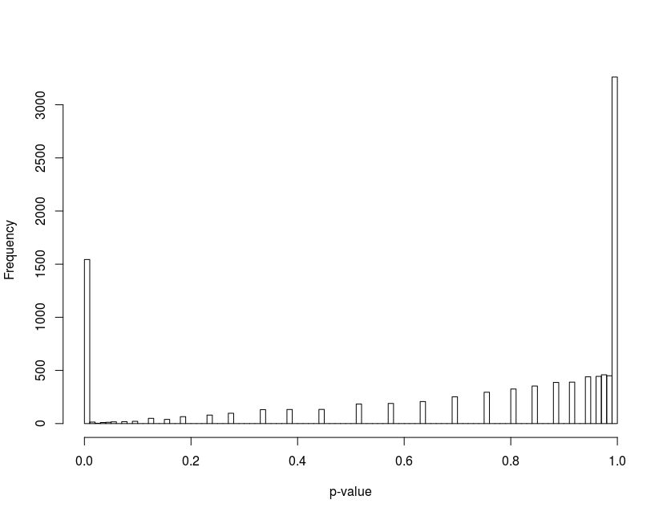

***
Established methods for synthesising a population from geographically aggregated data are robust and well understood. However, most rely on the potentially detrimental process of "integerisation" to generate whole individuals. This paper investigates alternative methods of synthesis that are computationally efficient and result in integer populations directly. We showcase the method of 'quasirandom sampling' for population synthesis and demonstrate its ability to generate populations that match geographically aggregated data, as long as fully-specified marginal data is available. The results show that sampling the marginals without replacement guarantees a match and that quasirandom sampling performs better than pseudorandom (or 'simple random') sampling at generating populations that fit multiple constraints. The algorithms are available in an open-source R package `humanleague`.

***

# Introduction

Iterative Proportional Fitting (IPF) is a popular and well-established technique for generating synthetic populations from marginal data.
Compared with other methods of 'population synthesis' IPF is relatively fast, simple and easy to implemented, as showcased in a practical introduction to the subject by @lovelace_spatial_2016.
Further, a number of software packages aimed at facilitating IPF for spatial microsimulation and other applications have been published [e.g. @barthelemy_cran_2016; @jones_raker:_2016].

However, the method has various limitations from the perspective of spatial microsimulation for social simulation. For example,
IPF generates fractional weights instead of integer populations, an issue tackled by 'integerisation' techniques [@lovelace_truncate_2013]; handles 'empty cells' poorly [@lovelace_evaluating_2015]; and requires a representative individual-level 'seed' population.
The most in-depth exploration of such limitations and the mathematical behaviour of IPF to date is an outstanding PhD thesis on the subject [@zaloznik_iterative_2011].

In this paper we investigate sampling techniques where a population matrix is built exclusively in the integer domain We show that this technique can only work effectively if a quasirandom (as opposed to a pseudorandom) number generator is used, and this in itself is not sufficient to work in all cases. We also show that this problem can be overcome by combining the quasirandom generator with a sampling-without-replacement algorithm. We then look at the statistical properties of the resulting populations, comparing them to populations generated with the IPF algorithm.

# Theory

## Quasirandom Numbers

Quasirandom numbers, often referred to as low discrepancy sequences, are preferential to pseudorandom numbers in many applications, despite not having some of the (appearance of) randomness that good pseudorandom generators possess. In this work we focus on the Sobol quasirandom sequence [@bratley_algorithm_1988; @joe_remark_2003].

Sobol, as with other quasirandom sequences, have an inherent dimensionality and a relatively short period - the sequence is exhausted once every integer in the sample space has been sampled . Successive samples tend to evenly fill the sample space, and thus successive samples lack independence. Conversely, a good pseudorandom generator has no discernible dependence between variates often has a much longer period, allowing for very large samples to be taken.

For applications such as numerical integration, Sobol sequences converge at a rate of $\approx1/N$ (actually $(ln N)^D/N$ [@vetterling_numerical_1992] compared to $\approx1/\sqrt N$ for a pseudorandom generator, and thus require far fewer samples to achieve the same level of accuracy.

Quasirandom sequences are not seeded like pseudorandom generators. To avoid repetition, and for better degeneracy, it is recommended to discard a number of variates on initialisation [@joe_remark_2003], and on subsequent sampling continue the sequence from its previous position.
For comparison in the analysis below, we use the MT19937 variant of the Mersenne Twister pseudorandom generator [@matsumoto_mersenne_1998].

### Sampling without Replacement

Given discretely distributed population $P$ with integral frequencies $\{f_0,f_1,...f_n\}$, a random sample $i \in \{0...n\}$ has probability 

$$p(i) = \frac{f_i}{\sum\limits_{j=0}^{n}f_j}$$

Once a sample $i$ is taken the distribution is adjusted to $\{f_0,f_1,...f_i-1,....f_n\}$. Once $f_i$ has reached zero no further samples can take the value $i$ since $p(i) = 0$. 

Since $f_i$ cannot be oversampled, this implies that $f_{j\neq{i}}$ cannot be undersampled. If follows that after sampling $P$ variates, $f_i = 0 \space\forall\space i \in \{0...n\}$. Thus there is a guarantee that the distibution is sampled exactly.

## Problem Statement

A mathematical statement of the microsimulation problem is as follows:^[In the notation below, the index $i$ is scalar and refers to a particular dimension. The index $\mathbf{k}$ is a vector index $\{k_1, k_2,...k_D\}$ of length $D$, the dimensionality of the problem.]

Given a population $P$ and a set of $D$ marginal vectors $\mathbf{m}_i$ of length $l_i$ such that we have $S$ possible states

$$S=\prod\limits_{i}l_i$$

Find a contingency table $\mathbf T$ in $D$ dimensions such that

$$\sum\limits_{\mathbf{k}, k_i fixed} \mathbf{T}_\mathbf{k} = \mathbf{m}_i$$

in other words each element of $\mathbf{m}_i$ is the sum of all elements in $\mathbf{T}$ for a fixed value of $k_i$. We define this as constraint (1).

Each marginal sum and the sum of the elements of contingency table must equal the population $P$:

$$\sum\limits \mathbf{m}_{i} = \sum\limits_\mathbf{k} \mathbf{T} = P$$ 

We define this as constraint (2). Finally, constraint (3) restricts the elements to the natural numbers: 

$${\mathbf{T} \in \mathbb{N}^S,\mathbf{m}_i} \in \mathbb{N}^{l_i}$$ 

In the general case this is an ill-posed problem as there are not enough constraints for a unique solution. Hence the need to resort to iterative or optimisation-type solutions, such as IPF, simulated annealing, maximum likelihood, chi-squared fitting, least-squares fitting.

# The Algorithms

The algorithms described in this paper are outlined in this section.

## Integer Quasirandom with-Replacement Sampling (IQRS)

1. Create a $D$-dimensional discrete with-replacement distribution using the marginals $\mathbf{m}_i$ to represent the per-zone totals within each variable category.

2. Sample $P$ quasirandom variates from this distribution to create a "seed" population $\mathbf{T}$. Specifically, we sample a value of $\mathbf{k}$ and increment the value of $\mathbf{T}_k$. Thus $\mathbf{T}$ will - by construction - satisfy constraints (2) and (3). The next step is to check, and adjust if necessary, the population such that constraint (1) is met.

3. Calculate the residual vector $\mathbf{r}_i$, the difference between the seed population and marginal $\mathbf{m}_i$: 
$$\mathbf{r}_i = \sum\limits_{\mathbf{k}, k_i fixed} \mathbf{T}_k - \mathbf{m}_i$$
If all elements of $\mathbf{r}_i$ are zero, constraint (1) is satisfied in dimension $i$. If not, find an index $\mathbf{k}$ in $\mathbf{T}$ such that subtracting $\mathbf{r}_i$ will not result in negative values in $\mathbf{T}$

4. If $\mathbf{k}$ exists, perform the subtraction:
$$\mathbf{T}_{\mathbf{k}, k_i fixed} \leftarrow \mathbf{T}_{\mathbf{k}, k_ifixed} - \mathbf{r}_i$$

5. Repeat step 3. as necessary for each dimension.

6. Compute a $\chi^2$ statistic and a p-value.

<!-- Explain p-value on first occurance (here) -->

Note that the algorithm will fail if, in any dimension, there is a nonzero residual and no index $\mathbf{k}$ from which the residual can be subtracted without resulting in negative elements of $\mathbf{T}$. This likelihood is vastly reduced by using quasirandom sampling. 

## Integer Quasirandom Without-Replacement Sampling (IQWS)

1. Create an D-dimensional discrete without-replacement distribution using the marginals $\mathbf{m}_i$

2. Sample $P$ random variates from this distribution to create a population $\mathbf{T}$. Specifically, we sample a value of $\mathbf{k}$ and increment the value of $\mathbf{T}_\mathbf{k}$, repeating until our distribution is fully depleted. Constructing the problem in this way automatically ensures that all constraints are automatically met.

3. Compute a $\chi^2$ statistic and a p-value.

## A Worked Example of IQRS

We consider a 2 dimensional case here for simplicity, for a population $P$ of 100 individuals with two categorical characteristics. Let the marginal vectors be $\mathbf{m}_0=\{51,49\}$ and $\mathbf{m}_1=\{35,40,25\}$, giving the population 6 possible states.    

We construct a bivariate discrete distibution using the marginals which will have a probability density

$$p_{ij} = \frac{(\mathbf{m}_0)_i(\mathbf{m}_1)_j}{\sum\limits_i\mathbf{m}_0\sum\limits_j\mathbf{m}_1}$$ 

We take $P$ random samples $(i,j)$ from this distribution to create a seed population $\mathbf{T}$ (in bold), which for example may look like:

 $\mathbf{m}_0\setminus\mathbf{m}_1$ |  35    | 40     | 25     | $\mathbf{r}_0$
:-----------------------------------:|--------|--------|--------|----
            51                       | **19** | **20** | **11** | *-1*
            49                       | **17** | **20** | **13** | *+1*
        $\mathbf{r}_1$               |  *+1*  |  *0*   | *-1*   |

The row and column sums do not quite match the marginals. The residuals (italic, from equation 5) are $\mathbf{r}_0=\{-1, 1\}$ and $\mathbf{r}_1=\{1,0,-1\}$.

To correct the population we subtract $\mathbf{r}_0$ from any one column (in this case no choice of column will result in a negative value). Selecting the first column, the population becomes:

 $\mathbf{m}_0\setminus\mathbf{m}_1$ |  35    | 40     | 25     | $\mathbf{r}_0$
:-----------------------------------:|--------|--------|--------|----
            51                       | **20** | **20** | **11** | *0*
            49                       | **16** | **20** | **13** | *0*
        $\mathbf{r}_1$               |  *+1*  |  *0*   |  *-1*  |
    
which now matches $\mathbf{m}_0$. Next we subtract $\mathbf{r}_1$ from the any one row (again no choice of row will result in a negative value). Selecting the first row, the population becomes:

 $\mathbf{m}_0\setminus\mathbf{m}_1$ |  35    | 40     | 25     | $\mathbf{r}_0$
:-----------------------------------:|--------|--------|--------|----
            51                       | **19** | **20** | **12** | *0*
            49                       | **16** | **20** | **13** | *0*
        $\mathbf{r}_1$               |  *0*   |  *0*   |  *0*   |

which results in a population that now matches both marginals. It should be noted that in this example there are six possible ways that the seed population could be adjusted.  

The IQWS algorithm, being simpler, does not warrant an example. The algorithm description above suffices.

## The Implementation

The algorithms are implemented in an `R` package called `humanleague`, written in `C++11` and `C` and interfaced using `Rcpp`. We used open source implementations of the Sobol sequence generator [@johnson_stevengj/nlopt:_nodate] and the incomplete gamma function [@burkardt_asa032_2008]. The remainder of the code was developed by the authors. The Sobol sequence generator is implemented in such a way that it is not reset each time a population is requested, allowing different populations to be generated each time. 

The intent is to submit the package to the offical CRAN repository, but until then it is available at [https://github.com/CatchDat/humanleague](https://github.com/CatchDat/humanleague).

The implementation supports dimensionalities up to the 12, although this limit is arbitrary and could be increased if necessary. Input is simply a list of marginal vectors

The output is broadly compatible with the established `mipfp` (Barthelemy & Suesse 2016) `R` package: 

- $D$-dimensional population array
- $D$-dimensional probability array
- boolean value indicating convergence
- maximum value of each residual vector
- $\chi^2$ statistic
- p-value

# Comparison of Methods

## Statistical Properties

We compare the two algorithms to IPF using a number of two-dimensional test cases.

No integerisation was done to the IPF data (using e.g. the `R` package `rakeR`) due to that fact that integerisation only guarantees constraints (1) and (3) are met, and can in fact break constraint (2) on a non-integer input that meets it. The $\chi^2$ value resulting from IPF is thus likely to be slightly lower due to the fact the numbers need not be integral.

IPF was initialised with a random seed array, each element uniformly distributed in $[0,2)$

The first three tests are made-up examples. The remainder are marginal figures derived from 2011 UK census data at the MSOA level (mid-layer super output area), with one dimension representing person status in terms of age, sex, and economic activity, the other their workplace location.
Interestingly, IPF performed least well on the simple tests, generating the lowest mean p-values (Table 1).

Table 1: Convergence behaviour of population synthesis algorithms. $\bar{c}$ refers to the convergence success rate, and $\bar{p}$ refers to the mean p-value.

 Pop | States | N | IQRS $\bar{c}$ | IQRS $\bar{p}$  | IQWS $\bar{c}$ | IQWS $\bar{p}$ | IPF $\bar{c}$ | IPF $\bar{p}$  
:---:|---|---|--------|--------|--------|--------|--------|--------|-------|-------|------
  20|    4|1000|1|0.78|1|0.79|1|0.48
 125|   25|1000|1|0.91|1|0.91|1|0.06
 935|   49|1000|1|0.74|1|0.86|1|0.03
4958|16032|1000|0|0.82|1|0.81|1|1
4098|11760|1000|0|0.84|1|0.8 |1|1
4029|11904|1000|0|0.81|1|0.8 |1|1
4989|14640|1000|0|0.8 |1|0.79|1|1
5219|15168|1000|0|0.79|1|0.79|1|1

A more detailed analysis was performed on two evenly distributed marginal vectors of length 10 and a population $P$ = 100 and number of states $S$ = 100, sampling 10000 populations.

Firstly we used the IQRS algorithm with a PRNG, and found only one attempt reached a valid population, i.e. a success rate of 0.01%. This confirms our earlier reasoning that quasirandom numbers are essential for the algorithm.

```{r, echo=FALSE, out.width="75%", fig.cap="Distribution of p-values of IQRS."}

```

Secondly, reverting back to a QRNG, we examined the distribution of p-values for IQRS, which can be seen in figure 1. In the analysis we assigned a p-value of zero to any case where the population did not match the marginals, which happened about 15% of the time.

Next we compared the performance of IQWS using a PRNG and a QRNG. Since we knew the algorithm is guaranteed to work regardless of the RNG used, we again looked at the distribution of p-values, which can be seen in figures 2 and 3. There is a marked difference between the two, with the PRNG implementation being broadly symmetric with a bias toward mid-range values, whereas the QRNG implementation is very strongly biased toward high p-values. 

```{r, echo=FALSE, out.width="75%", fig.cap="Distribution of p-values of IQWS using PRNG."}
knitr::include_graphics("figures/iqws_prng_pvalue_dist.png")
```

```{r, echo=FALSE, out.width="75%", fig.cap="Distribution of p-values of IQWS using QRNG"}
knitr::include_graphics("figures/iqws_pvalue_dist.png")
```

If the result of the IQWS algorithm is used as the seed for the IPF algorithm, the latter simply returns the seed matrix. This happens even when we deliberately pick a result with a low (>0.005) p-value.

## Range of Use

IPF can be used for microsimulation in cases where some marginal data is not fully specified. For example, some categorical constraint data may only be available for a subset of the whole population. By using this data in the initial guess for the iteration, rather than as a marginal constraint, the incomplete data is scaled up to, and smoothed over, the overall population. An example of this type of microsimulation is given in @[Lovelace

The methods described in this paper are not able to generate populations in this case.

## Performance

The performance of the algorithms of the tests described above is illustrated in Table 2. Since computers vary widely in performance for numerous reasons, the numbers should be interpreted as relative performance indicators, not absolute values.

Table 2: Relative computation time of the algorithms, using the first case as a baseline. 

Pop | States | N | IQRS | IQWS | IPF 
:--:|-----|----|----|----|-----
  20|    4|1000|1.0 |1.0 |66.3
 125|   25|1000|1.3 |1.3 |96.7
 935|   49|1000|2.3 |2.3 |68.3
4958|16032|1000|31.7|30.7|1559.3
4098|11760|1000|25.7|23.0|1069.0
4029|11904|1000|26.7|22.7|1027.3
4989|14640|1000|31.7|28.3|1457.0
5219|15168|1000|32.0|28.7|1557.7

<!-- ref Mark/Robin paper(s) -->

# Discussion

The methods presented here, Integer Quasirandom with-Replacement Sampling and Integer Quasirandom Without-replacement Sampling, really represent an evolution of a single algorithm. The earlier (IQRS) has a flaw in that it lacks guaranteed convergence, which is addressed by IQWS. As such, this discussion focuses solely on IQWS. 

IQWS has some advantages over traditional IPF, primarily the generation of integer populations by default, which may be beneficial for example in agent-based modelling (ABM) applications.

However, IQWS is more limited in it's application, requiring that all marginal data is fully specified, (i.e. matches the entire population) whereas IPF is not so retricted.

In terms of performance, IQWS is significantly faster than the IPF implementation we compared against (`mipfp`). This is likely due to the fact that the algorithm is not iterative in nature, and that the implementation is very efficient, written in a low-level language. The performance of population synthesis is often not the bottleneck in any workflow, so performance may not be considered a major advantage.

Another possible disadvantage is that IQWS generally results in populations with lower p-values than IPF. We would envisage that end-users check the p-value against a suitable threshhold, and reject and resample if necessary.

# Conclusion

Although IQRS may be of limited use due to the fact it cannot always generate a population, we believe IQWS is promising as a technique that could complement existing techniques, especially when integral populations are important. We do recommend that users satisfy themselves that the resulting population is adequately degenerate.


<!-- Expand on this - need to be much wordier and eloquent here, and refer back more to literature -->

We anticipate further investigation of the algorithms for deliberately generating populations with low p-values, in cases where the marginals are known to be strongly correlated. We have not studied the application of these algorithms for anonymisation of populations [@nowok_synthpop:_2016]

# Acknowledgements

Catch! project funding

# References

```{r}
# Get bibliography (run once from project root)
u = "https://www.zotero.org/api/groups/418217/collections/MP7NS3SC/items/top?limit=100&format=bibtex&v=1"
b = httr::GET(url = u, httr::write_disk("ref.bib", overwrite = T))
```


@kavroudakis_sms:_2015 focus on the spatial variability of individual-level dat.
